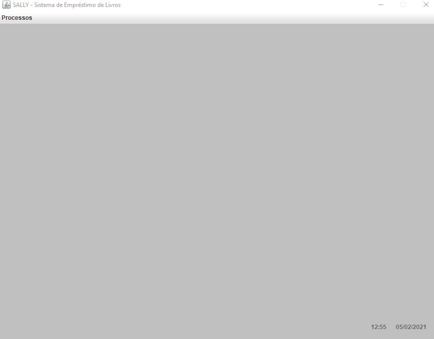
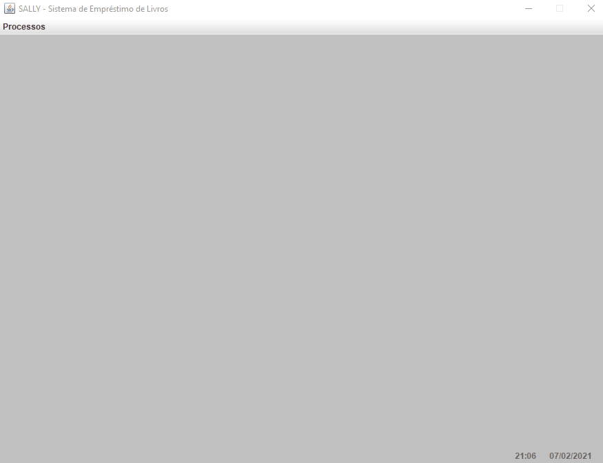

<h1 align="center">  Sally - Sistema de Biblioteca </h1>

## 💻 Aplicação

Sistema básico para biblioteca que contempla as suas funções básicas para utilizar em produção

O software contém:

* Cadastro de clientes
* Cadastro de livros 
* Cadastro de empréstimos
* Consulta de clientes
* Cadastro de livros
* Controle de devoluções
* Controle de multas

## 🚀 Tecnologias

* Java 11
* PostgreSQL

## Pré-requisito

É necessário a instalação dos seguintes componentes:

> • PostgreSQL 13 • pgJDBC 42.2.18

É recomendável utilizar o VSCode 1.52 com as seguintes extensões:

> *Project Manager for Java 0.17.0* • *PostgreSQL 1.1.17* • *Java Extension Pack 0.12.1*  

### Telas

## 📝 Licença

Esse projeto está sob a licença MIT. 

## 💻 Equipe de desenvolvimento

<table>
  <tr>
    <td align="center"><a href="https://github.com/ccarmo"> <b>Carlos Henrique</b></a> </td>
</table>

